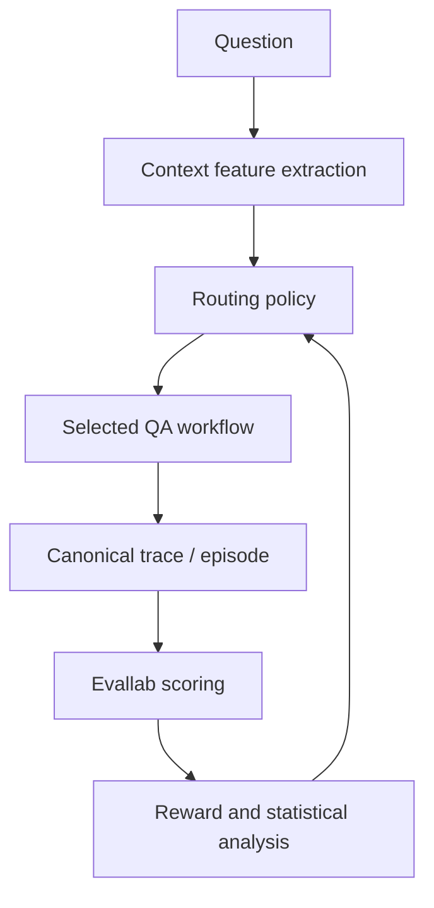

# EvidenceRoute

**Statistical evaluation and contextual-bandit routing for reliable enterprise question answering.**

> ⚠️ **Status: week 1 of 12 — scaffolding.** The research protocol, action space,
> data model and reward layer exist and are tested. Retrieval, generation,
> routing and the offline policy evaluation study are scheduled. No results are
> claimed yet, and none will be until the protocol is frozen and the frozen run
> has executed.

---

## The question

> Can an adaptive routing policy select the least expensive sufficient
> question-answering workflow while preserving or improving evidence-grounded
> answer quality relative to fixed RAG and fixed agentic baselines?

Most enterprise question answering is built as "vector database plus LLM",
applied uniformly to every question. That is an architectural assumption, not a
measured decision. EvidenceRoute treats workflow selection as a sequential
decision problem: for each question, several candidate workflows are executed
and compared on correctness, evidence support, retrieval quality, hallucination
risk, calibration, cost and latency — and a routing policy learns which to
select from features observable *before* the answer is known.

Agentic AI is included as **one candidate action**, not as the project's
identity and not as an assumed winner.

## Architecture



The feedback arrow is learning from historical experiment outcomes and simulated
logged feedback. It is **not** uncontrolled online learning in production.

## Action space

| ID | Action | Retrieval | Notes |
| --- | --- | --- | --- |
| A0 | Direct answer | — | No-retrieval baseline; quantifies unsupported-but-plausible answers |
| A1 | BM25 + generation | lexical | Classical baseline; strong on exact terminology and figures |
| A2 | Dense + generation | embedding | Handles paraphrase and terminology mismatch |
| A3 | Hybrid + generation | RRF fusion | Fusion method is explicit, not implied |
| A4 | Hybrid + rerank + generation | RRF + reranker | Must earn its added latency and cost |
| A5 | Bounded agentic retrieval | multi-step | Step, token and time limits enforced |
| A6 | Abstain | — | With a machine-readable reason code |

## Relationship to Evallab

Two repositories, two responsibilities:

| | Owns |
| --- | --- |
| [`evallab`](https://github.com/tabers77/evallab) | Reusable evaluation infrastructure: canonical episodes, scorer protocols, score vectors, reward composition, reporting |
| `evidence-route` | The research application: datasets, retrieval, workflows, routing features, bandit policies, OPE, statistics |

Keeping them apart is the point — it demonstrates that Evallab is genuinely
reusable rather than coupled to one application, and it keeps experimental
dependencies out of the framework core. If EvidenceRoute needs a
generally-useful capability, it is built and tested in Evallab first, then
consumed here.

---

## Setup

Requires Python 3.10+ and a local checkout of `evallab` alongside this repo.

```bash
# Windows
.\tasks.ps1 install

# macOS / Linux
make install
```

That creates `.venv`, installs the package with dev tools (~350 MB), and
installs the sibling `evallab` checkout as an editable dependency.

Then verify:

```bash
.venv/Scripts/evidence-route env check     # Windows
.venv/bin/evidence-route env check         # macOS / Linux
```

### Credentials

Copy the template and fill in your own values:

```bash
cp .env.example .env
```

`.env` is gitignored and must never be committed. No endpoint, deployment name,
key or tenant appears anywhere in this repository — configs refer to credentials
indirectly (`deployment_ref: chat`), resolved at runtime through
`evidence_route.config.Settings`. Secrets use `SecretStr`, so an accidental
`print()` or a config dump into a run manifest yields `**********`.

**Everything below runs without credentials.** The default test suite and the
smoke experiment are offline by design.

```bash
.\tasks.ps1 test        # or: make test
```

### Dependency extras

Extras are grouped by install weight as well as function, because `torch` is
roughly ten times the size of everything else combined:

| Extra | Size | Contents |
| --- | --- | --- |
| `dev` | ~350 MB | pytest, ruff, mypy + core |
| `retrieval` | +30 MB | `rank-bm25`, `faiss-cpu` |
| `generation` | +20 MB | Azure OpenAI SDK, `azure-identity` |
| `analysis` | +200 MB | scikit-learn, scipy, statsmodels, matplotlib |
| `all` | ~600 MB | Full Azure-backed experiment environment |
| `local-models` | **+3–4 GB** | `sentence-transformers`, `torch` — local embedding/reranking path only |

`all` deliberately excludes `local-models`. Azure deployments are the primary
path for embeddings and generation; local models are a documented fallback so
the benchmark remains reproducible without an Azure account, and belong in the
container rather than on the host.

### Container

The image is a **reproduction artifact, not the development loop** — daily work
happens in the local venv, which is faster and debuggable. The container exists
so a reviewer on any OS can reproduce the small benchmark, and so CI runs what
you ran.

```bash
docker compose build              # slim: core + dev, ~250 MB
docker compose run --rm app       # default test suite
docker compose run --rm app bash  # interactive shell

docker compose --profile full build   # full experiment stack, several GB
```

---

## Repository layout

```
configs/       version-controlled experiment configuration (no secrets)
data/          manifests, checksums and frozen splits — not the corpora
src/           the package: everything that produces a reported number
tests/         unit, integration, smoke; live-model tests are opt-in
experiments/   the frozen research protocol, run outputs, curated summaries
reports/       technical report, system card, human evaluation protocol
scripts/       thin CLI wrappers for the pipeline sequence
notebooks/     exploration only, never the canonical pipeline
```

## Commands

```bash
evidence-route env check         # verify the environment (works today)
evidence-route actions list      # the routing action space (works today)
evidence-route profiles          # declared reward profiles (works today)

evidence-route data prepare    --config configs/datasets/financebench.yaml
evidence-route index build     --experiment configs/experiments/mvp.yaml
evidence-route outcomes run    --experiment configs/experiments/mvp.yaml
evidence-route router train    --config configs/routers/linucb.yaml
evidence-route bandit simulate --config configs/experiments/ope_simulation.yaml
evidence-route ope evaluate    --config configs/experiments/ope_study.yaml
evidence-route policy evaluate --experiment configs/experiments/final_test.yaml
evidence-route report build    --experiment-id final-v1
```

Scheduled commands exit with the roadmap week that delivers them rather than a
traceback.

---

## Method commitments

These are properties of the experiment, enforced in code and CI rather than left
to discipline.

**The protocol is written before the results.** Hypotheses, primary comparison,
metrics and practical-significance thresholds are recorded in
[`experiments/protocols/protocol_v1.md`](experiments/protocols/protocol_v1.md)
and frozen before the test split is read. Hypotheses chosen after seeing results
are not hypotheses.

**The test split is locked.** `protect_test_split` defaults to true, the final
config requires an explicit unlock, and CI fails if that unlock is ever
committed. Running it is a one-way door: after it executes, no further tuning
may be driven by what it showed.

**Splits are grouped, not random.** Several FinanceBench questions reference the
same filing, so question-level random splitting would leak document-specific
patterns into test in a way no confidence interval would reveal.

**The router may only use pre-answer features.** Any feature derived from the
answer, the reference answer, or a workflow the router did not pay for makes the
routing claim undeployable. Retrieval-probe cost is charged to the router — a
router that secretly runs every expensive workflow before choosing is not cheap.

**Raw and derived data stay separate.** Expensive outcomes are stored apart from
scorer conclusions, so metrics, normalization and reward weights can be revised
without re-running a single paid API call.

**Comparisons are paired, and replicates are not extra data.** All workflows run
on the same questions. Repeated generations of one question are replicates;
resampling clusters at question level rather than pretending to more data than
exists.

**Every result carries its provenance.** Commit SHA, worktree cleanliness,
Python version, dataset checksums, model versions, prompt versions and seeds are
captured per run. A run from a dirty worktree is marked illustrative, not
reproduced.

**Null results are published.** The project succeeds if the router does *not*
beat the strongest fixed baseline, provided the experiment is sound, the outcome
is reproducible and the reason is investigated. A sound negative result is a
stronger signal than an unverified improvement.

---

## Roadmap

12 weeks at ~5 h/week. If time runs short, the statistical core is protected and
optional model comparisons are cut first.

| Week | Deliverable | Status |
| --- | --- | --- |
| 1 | Research protocol and repository foundation | in progress |
| 2 | Dataset and document pipeline | |
| 3 | No-retrieval and BM25 baselines | |
| 4 | Dense and hybrid retrieval | |
| 5 | Reranking and agentic workflow | |
| 6 | Reliability, calibration and abstention | |
| 7 | Full-information outcome matrix | |
| 8 | Routing baselines | |
| 9 | Contextual-bandit policies | |
| 10 | Offline policy evaluation study | |
| 11 | Final evaluation and failure analysis | |
| 12 | Portfolio release | |

The first code milestone is deliberately small: *one FinanceBench example runs
through BM25 retrieval, produces a structured answer and citations, becomes an
Evallab episode, receives deterministic scores and generates a report.* Dense
retrieval, agentic execution and contextual bandits come only after that
vertical slice works.

## Cost

The full outcome matrix is bounded by a configured budget ceiling (default USD
25) and aborts before crossing it. A dry run estimates spend on a subset first.
Retries are recorded with their token cost rather than silently absorbed.

A low-cost reproduction path exists and needs no API key: the offline smoke
experiment runs from checked-in fixtures and is what CI executes on every push.

## Specification and progress

[`docs/EVIDENCEROUTE_PROJECT_SPECIFICATION.md`](docs/EVIDENCEROUTE_PROJECT_SPECIFICATION.md)
is both the full specification — research questions, hypotheses, evaluation
dimensions, failure taxonomy, risks and roadmap — and the implementation
tracker. Section 0 summarises what is built; section 31 tracks it per item.

A box there is ticked only when the work is implemented **and** covered by
passing tests. A written config is not a built feature.

## License

MIT for the code. Datasets retain their own licenses and are not redistributed
here — see [`data/README.md`](data/README.md).
