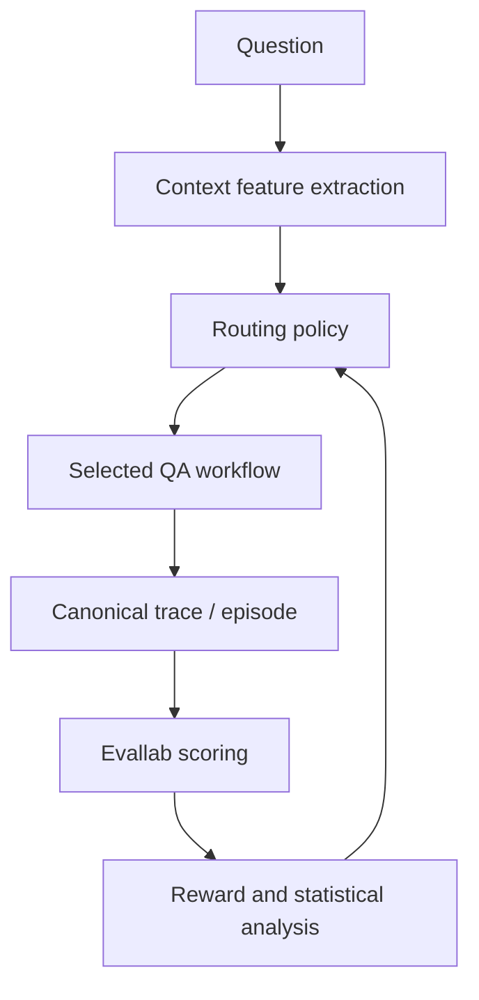

# EvidenceRoute

## Statistical Evaluation and Contextual-Bandit Routing for Reliable Enterprise Question Answering

**Document type:** Portfolio project specification, implementation plan and **implementation tracker**  
**Working repository name:** `evidence-route`  
**Recommended GitHub repository:** `tabers77/evidence-route`  
**Relationship to Evallab:** EvidenceRoute is a separate research application that imports and uses `evallab` as its evaluation and reward layer.  
**Initial project duration:** 12 weeks at approximately 5 hours per week  
**Primary technical themes:** statistics, NLP, information retrieval, contextual bandits, offline policy evaluation, reliable AI, LLM evaluation, controlled use of agentic workflows

---

## 0. Implementation status

This document is both the specification and the single source of truth for what
has actually been built. The backlog in section 31 carries per-item status; this
section is the summary.

**Last updated:** 2026-08-15 · **Current week:** 1 of 12 · **Version:** 0.1.0

### Status legend

| Marker | Meaning |
| --- | --- |
| ✅ | Implemented and covered by passing tests |
| 🟡 | Partially implemented — usable, but incomplete against the spec |
| 📋 | Designed and documented, not yet implemented (package exists, no logic) |
| ⬜ | Not started |
| 🔒 | Deliberately deferred or out of MVP scope |

### Epic summary

| Epic | Status | Notes |
| --- | --- | --- |
| A — Foundation | ✅ | Package, tooling, CI, container, Evallab dependency wired |
| B — Research protocol | 🟡 | `protocol_v1.md` drafted; not yet frozen, decisions 2/3/6 open |
| C — Data | 📋 | Configs and data card written; no loaders yet |
| D — Workflows | 📋 | Action space + outcome schema done; no workflow executes yet |
| E — Evallab integration | 📋 | Boundary verified by tests; adapters not written |
| F — Routing | 📋 | Configs written; no feature extractor or policy yet |
| G — Offline evaluation | 📋 | Bandit log schema + propensity validation done; no estimators |
| H — Reliability and statistics | 📋 | Reward profiles done; no bootstrap or calibration yet |
| I — Publication | 📋 | Report skeletons in place; nothing to report yet |

### What runs today

```
evidence-route env check         # environment, credentials, Evallab availability
evidence-route actions list      # the routing action space
evidence-route profiles          # declared reward profiles and weights
pytest -m "not llm and not slow" # 89 tests, offline, no API key required
```

### Implemented modules

| Module | Status | What it does |
| --- | --- | --- |
| `workflows/actions.py` | ✅ | Action space A0–A6, abstention reason codes, arm-index mapping |
| `storage/records.py` | ✅ | The four section-20 record schemas with their validity constraints |
| `evaluation/rewards.py` | ✅ | Four reward profiles, quality composition, reward breakdown |
| `evaluation/reproducibility.py` | ✅ | Run manifests: git state, checksums, environment, publishability |
| `config.py` | ✅ | Environment settings; Azure credentials via `SecretStr`, never in repo |
| `cli.py` | 🟡 | Full command surface; three commands live, the rest report their week |

Every other subpackage under `src/evidence_route/` is 📋 — the directory and its
design constraints exist, the logic does not. No stub returns fake data.

### Roadmap progress status

| Week | Deliverable | Status |
| --- | --- | --- |
| 1 | Research protocol and repository foundation | 🟡 in progress |
| 2 | Dataset and document pipeline | ⬜ |
| 3 | No-retrieval and BM25 baselines | ⬜ |
| 4 | Dense and hybrid retrieval | ⬜ |
| 5 | Reranking and agentic workflow | ⬜ |
| 6 | Reliability, calibration and abstention | ⬜ |
| 7 | Full-information outcome matrix | ⬜ |
| 8 | Routing baselines | ⬜ |
| 9 | Contextual-bandit policies | ⬜ |
| 10 | Offline policy evaluation study | ⬜ |
| 11 | Final evaluation and failure analysis | ⬜ |
| 12 | Portfolio release | ⬜ |

### Open decisions blocking the protocol freeze

These must be settled before section 21's week 11 can run. Tracked in
`experiments/protocols/protocol_v1.md`.

| # | Decision | Status |
| --- | --- | --- |
| 2 | Primary generation model (Azure chat deployment) | ⬜ open |
| 3 | Embedding model | 🟡 Azure primary chosen; deployment not named |
| 6 | Reranker: cross-encoder vs Azure LLM reranker | ⬜ open — decided week 5 on measured evidence |

---

## 1. Executive summary

EvidenceRoute is a research-engineering portfolio project that investigates a practical question:

> Can a learned decision policy determine when an enterprise question should use lexical retrieval, dense retrieval, hybrid retrieval, reranking, an agentic workflow, or abstention—improving answer reliability while controlling monetary cost and latency?

The project is deliberately different from a conventional RAG demonstration. It does not begin with the assumption that a vector database plus an LLM is the correct solution for every query. Instead, it treats architecture selection as a sequential decision problem that must be formulated, measured and evaluated.

For each question, several candidate workflows are executed and compared. Their outputs are evaluated across answer correctness, evidence support, retrieval quality, hallucination risk, calibration, cost and latency. A routing policy then learns which workflow to select from observable query and retrieval features.

The project combines four areas that support Carlos De La Cruz's desired professional positioning:

1. **Statistics and experimental design** — baselines, hypotheses, uncertainty intervals, paired comparisons, calibration, sensitivity analysis and reproducibility.
2. **Natural language processing** — lexical and semantic retrieval, reranking, question classification, evidence-grounded generation and hallucination analysis.
3. **Reinforcement learning and decision-making** — contextual bandits, exploration versus exploitation, reward design and offline policy evaluation.
4. **Reliable AI systems** — abstention, failure analysis, cost-quality trade-offs, auditability, testing and production-oriented architecture.

Agentic AI is included as one candidate workflow. It is not the identity of the project and is not assumed to be the best solution. This supports the positioning that Carlos understands modern agentic systems but applies them within a broader foundation in machine learning, statistics and reliable system design.

---

## 2. Repository decision and relationship to Evallab

### 2.1 Recommendation

Create a new repository named `evidence-route` and use Evallab as a dependency.

Do **not** implement EvidenceRoute directly inside the Evallab repository.

The two repositories have different responsibilities:

| Repository | Primary responsibility | Portfolio evidence |
| --- | --- | --- |
| `evallab` | Reusable, framework-agnostic evaluation infrastructure | Software architecture, protocol-based design, adapters, scorers, reward functions, reports and testing |
| `evidence-route` | Concrete NLP/RL research application and reproducible benchmark | Scientific reasoning, baselines, statistical evaluation, contextual bandits, retrieval, reliability and business relevance |

### 2.2 Why a separate repository is better

A separate repository provides several advantages:

- It demonstrates that Evallab is genuinely reusable rather than tightly coupled to one application.
- It keeps domain-specific datasets, retrieval code and experiments out of the framework core.
- It allows EvidenceRoute to have its own research question, hypotheses, results, model/system card and technical report.
- It gives recruiters two distinct but connected artifacts: an evaluation framework and an application that consumes it.
- It protects Evallab from experimental dependencies such as vector databases, embedding libraries, rerankers and model-provider SDKs.
- It makes it possible to publish EvidenceRoute results without representing experimental code as part of Evallab's stable API.

### 2.3 Recommended dependency strategy

During early development, EvidenceRoute can use Evallab through a local editable dependency:

```bash
pip install -e ../evallab
```

The EvidenceRoute `pyproject.toml` can initially document Evallab as a local development dependency. Once Evallab has a stable tagged release or package distribution, EvidenceRoute should pin a version or commit.

Examples:

```toml
# Development phase: local editable installation handled outside pyproject.

# Later, after a stable Evallab release:
dependencies = [
  "agent-eval>=0.1,<0.2"
]
```

If Evallab is not published to a package index, pinning a Git commit is preferable to tracking a moving branch in final reproducibility instructions.

### 2.4 Boundary between the repositories

EvidenceRoute should own:

- Dataset download and preprocessing.
- Document parsing and chunking.
- BM25, dense and hybrid retrieval.
- Reranking.
- Generation and agentic workflows.
- Query and retrieval feature extraction.
- Routing policies.
- Contextual-bandit simulation.
- Offline policy evaluation experiments.
- Experiment configuration.
- Domain-specific metrics.
- Statistical analysis notebooks or scripts.
- Final benchmark tables, figures and reports.

Evallab should own:

- Canonical `Episode` and `Step` representations.
- Adapters that transform workflow traces into canonical episodes.
- Generic scorer interfaces.
- Reusable deterministic and LLM-judge scorers.
- `ScoreVector` construction.
- Reward composition.
- Generic HTML, JSON and terminal reporting.
- Evaluation comparison primitives.

If EvidenceRoute requires a generally useful Evallab feature, it should first be implemented and tested in Evallab, then consumed from EvidenceRoute. Domain-specific logic should remain in EvidenceRoute.

---

## 3. Strategic purpose

### 3.1 The professional signal

EvidenceRoute should communicate the following:

> I do not merely connect an LLM to a vector database. I formulate the decision problem, define baselines, measure uncertainty, compare system designs, learn an adaptive policy, quantify reliability and operational trade-offs, and document where the system fails.

This is the central differentiator from generic AI application portfolios.

### 3.2 Capabilities demonstrated

The completed project should provide evidence of:

- Understanding of classical information retrieval and modern embedding retrieval.
- Ability to compare deterministic and agentic architectures.
- Understanding of contextual-bandit problem formulation.
- Knowledge of logged-feedback limitations and counterfactual evaluation.
- Statistical discipline in the interpretation of non-deterministic AI systems.
- Ability to design evaluation datasets and scoring policies.
- Awareness of judge bias, metric gaming and hallucination risk.
- Production-quality Python packaging, tests, configuration and repeatable experiments.
- Ability to translate a research question into an operational AI decision system.

### 3.3 What the project should not become

EvidenceRoute should not become:

- Another general-purpose chat interface.
- A demonstration containing many frameworks but no controlled experiment.
- A collection of unrelated notebooks.
- A benchmark where only the most favorable result is reported.
- A claim that agentic RAG is automatically superior.
- A large web-development project that consumes time better spent on experimentation.
- A GRPO fine-tuning project before the routing and evaluation baselines work.

---

## 4. Research problem

### 4.1 Primary research question

> Can an adaptive routing policy select the least expensive sufficient question-answering workflow while preserving or improving evidence-grounded answer quality relative to fixed RAG and fixed agentic baselines?

### 4.2 Supporting research questions

1. Under which query conditions does BM25 outperform dense retrieval?
2. When does hybrid retrieval materially improve evidence recall?
3. When is reranking worth its additional latency and cost?
4. Does a multi-step agentic workflow improve complex questions sufficiently to justify its operational cost?
5. Can retrieval-score distributions and query characteristics predict the best workflow?
6. Can an abstention policy reduce unsupported answers without making the system unusably conservative?
7. How much performance is lost when the routing policy receives only partial logged feedback instead of full-information outcomes?
8. Which offline policy estimators are most reliable under different behavior-policy propensities and sample sizes?
9. Are conclusions stable across domains, model providers and reward-weight settings?
10. Which failure modes remain invisible to automated LLM judges?

### 4.3 Initial hypotheses

The hypotheses must be written before inspecting the final test-set results.

Suggested hypotheses:

- **H1:** No single fixed workflow will dominate across correctness, cost and latency for every query type.
- **H2:** Hybrid retrieval plus reranking will improve evidence recall for difficult questions but will not provide sufficient benefit for simple high-overlap questions.
- **H3:** A contextual router will achieve a better quality-cost Pareto position than the best fixed workflow.
- **H4:** Routing features derived from retrieval agreement, retrieval margin and question type will be more predictive than query length alone.
- **H5:** An explicit abstention action will reduce the rate of unsupported answers at an acceptable reduction in answer coverage.
- **H6:** A fixed agentic workflow will have higher average cost and latency, while providing concentrated value on multi-step or evidence-synthesis questions.
- **H7:** Doubly robust off-policy evaluation will be more stable than basic inverse propensity scoring when the reward model is reasonably specified and behavior-policy coverage is adequate.
- **H8:** LLM-judge results alone will overestimate performance on at least one important failure category compared with human or deterministic evaluation.

### 4.4 Null results are acceptable

The project is successful even if the learned router does not beat the strongest fixed baseline, provided that:

- The experiment is correctly designed.
- The outcome is reproducible.
- The reason is investigated.
- Statistical uncertainty is reported.
- The limitations of the context features, sample size or reward are explained.
- Negative findings are included in the final report.

Publishing a sound negative result can provide a stronger research signal than presenting an unverified improvement.

---

## 5. System overview



The final arrow represents learning from historical experiment outcomes or logged feedback. It does not imply uncontrolled online learning in production.

### 5.1 Core execution sequence

For each question:

1. Load the question and its associated document collection.
2. Extract observable context features.
3. Select a workflow using a fixed baseline or learned policy.
4. Execute retrieval, generation or agentic steps.
5. Capture trace events, retrieved evidence, answer, token usage, latency and errors.
6. Convert the trace into Evallab's canonical episode representation.
7. Run deterministic, model-based and optional human scorers.
8. Construct a multi-dimensional `ScoreVector`.
9. Convert the score vector into one or more scalar reward definitions.
10. Store raw outcomes separately from derived scores.
11. Compare policies using held-out data and uncertainty estimates.

---

## 6. Candidate workflow actions

The policy's action space should remain small and interpretable in the MVP.

### Action A0: Direct answer without retrieval

Purpose:

- Establish a no-retrieval baseline.
- Detect questions that the model can answer without document access.
- Quantify unsupported but plausible answers.

Risks:

- Parametric-memory hallucination.
- Correct answer without acceptable evidence.
- Data contamination from pretraining.

### Action A1: BM25 retrieval plus answer generation

Purpose:

- Provide a strong classical lexical baseline.
- Handle queries with explicit terminology, names, figures and exact phrases.

Required outputs:

- Ranked document chunks.
- BM25 scores.
- Evidence identifiers.
- Generated answer with citations.

### Action A2: Dense retrieval plus answer generation

Purpose:

- Evaluate semantic retrieval.
- Handle paraphrases and terminology mismatch.

Required outputs:

- Embedding-model version.
- Similarity scores.
- Index configuration.
- Retrieved chunks and citations.

### Action A3: Hybrid retrieval plus answer generation

Purpose:

- Combine lexical and semantic evidence.
- Test whether fusion improves evidence coverage.

The fusion method must be explicit, for example reciprocal rank fusion. Avoid describing the system as hybrid without documenting how rankings are combined.

### Action A4: Hybrid retrieval, reranking and answer generation

Purpose:

- Measure whether a cross-encoder or LLM reranker improves final evidence quality.
- Quantify the extra latency and cost.

### Action A5: Multi-step agentic retrieval

Purpose:

- Support decomposition, repeated evidence search and synthesis for complex questions.
- Compare an agentic approach against deterministic workflows.

Suggested tool set:

- Search the document collection.
- Read a selected chunk or section.
- Retrieve neighboring chunks.
- Perform deterministic arithmetic when required.
- Submit an evidence-grounded answer.

The agent should use an allowlisted, intentionally small tool set. More tools do not automatically create a better experiment.

### Action A6: Abstain or request human review

Purpose:

- Treat non-answering as a valid reliability decision.
- Support risk-coverage evaluation.
- Avoid forcing a system to answer when retrieval confidence or evidence support is insufficient.

The abstention output should include a machine-readable reason code, such as:

- `insufficient_evidence`
- `retrieval_disagreement`
- `ambiguous_question`
- `conflicting_documents`
- `calculation_unverified`
- `policy_low_confidence`

---

## 7. Datasets and evaluation corpus

### 7.1 Primary dataset: FinanceBench

Use the public FinanceBench sample as the principal business-facing benchmark.

Repository: <https://github.com/patronus-ai/financebench>

Why it fits:

- Questions concern public financial documents.
- Answers have associated evidence.
- Questions include extraction, numerical reasoning and evidence synthesis.
- The setting resembles enterprise decision support more closely than a general trivia dataset.
- Documents are public and the benchmark is recognizable.

Important limitation:

The public sample is relatively small. It should be treated primarily as a high-quality held-out evaluation set, not an unlimited source of bandit training observations.

### 7.2 Supporting retrieval dataset: BEIR / FiQA

Repository: <https://github.com/beir-cellar/beir>

Use a manageable FiQA subset to:

- Compare retrieval approaches on more queries.
- Test whether retrieval conclusions generalize.
- Train or validate routing features without consuming FinanceBench test examples.

Do not run every BEIR dataset in the MVP.

### 7.3 Supporting reliability corpus: RAGTruth

Repository: <https://github.com/ParticleMedia/RAGTruth>

Use RAGTruth selectively to:

- Validate hallucination or evidence-support scorers.
- Study whether automated judges identify annotated unsupported spans.
- Avoid relying entirely on self-generated evaluation examples.

RAGTruth should support scorer validation. It does not need to become a third full application branch.

### 7.4 Dataset split policy

Before experimentation, define:

- Development set.
- Validation set for configuration and reward selection.
- Untouched test set.
- Optional challenge set containing difficult or adversarial examples.

Document-level leakage must be considered. If multiple questions reference the same document or company, random question-level splitting may leak document-specific patterns. Prefer grouping by document, company or source where feasible.

### 7.5 Dataset versioning

The repository should contain metadata and scripts, not copyrighted or oversized source documents unless their licenses permit redistribution.

Store:

- Dataset name and version.
- Original source URL.
- License information.
- Download timestamp.
- File checksums.
- Transformation steps.
- Split-generation seed.
- Final example identifiers in each split.

---

## 8. Context features for routing

The router may only use information available before the final answer is known.

### 8.1 Query features

- Token and character length.
- Number of sentences.
- Named-entity counts and types.
- Presence of numbers, dates, percentages or currency.
- Question-type classification: extraction, comparison, arithmetic, synthesis or unanswerable.
- Lexical specificity.
- Ambiguity signals.
- Requirement for multiple facts.
- Presence of explicit document, company or section references.

### 8.2 Retrieval-probe features

A low-cost first-stage retrieval probe can generate:

- Top BM25 score.
- BM25 top-1 versus top-2 margin.
- Top dense-retrieval similarity.
- Dense top-1 versus top-2 margin.
- Agreement between lexical and dense top results.
- Reciprocal-rank overlap.
- Retrieval-score entropy.
- Number of distinct documents in the top results.
- Evidence redundancy.
- Estimated context length.

The cost of producing routing features must be included in total system cost. A router should not be described as cheap if it secretly executes all expensive workflows before choosing one.

### 8.3 Router-confidence features

- Maximum action probability.
- Difference between the first and second action probabilities.
- Prediction entropy.
- Distance from training distribution.
- Missing-feature indicators.

These features can also inform abstention.

---

## 9. Routing baselines and learned policies

### 9.1 Fixed-policy baselines

Every question uses the same action:

- Always BM25.
- Always dense retrieval.
- Always hybrid retrieval.
- Always hybrid plus reranking.
- Always agentic.
- Always use the cheapest non-abstaining workflow.
- Always use the empirically strongest validation workflow.

### 9.2 Rule-based router

Create an interpretable baseline such as:

- Use BM25 for high lexical-overlap questions.
- Use hybrid retrieval when BM25 and dense retrieval disagree.
- Use the agentic workflow for predicted multi-step questions.
- Abstain when all retrieval scores are below validation thresholds.

Rules and thresholds must be selected using development or validation data, never the final test set.

### 9.3 Supervised oracle-imitation router

Because the experimental phase can run every action for each development question, it can identify the best action under a predefined reward. This creates full-information labels for supervised routing.

Candidate models:

- Multinomial logistic regression.
- Decision tree.
- Random forest or gradient boosting.
- Small calibrated neural network only if justified.

Simple models should be treated as serious baselines. The project should not assume a neural router is superior.

### 9.4 Contextual-bandit policies

Recommended MVP algorithms:

- Epsilon-greedy contextual policy.
- LinUCB.
- Contextual Thompson Sampling.

The primary purpose is to demonstrate correct problem formulation and evaluation, not to implement every known bandit algorithm.

### 9.5 Oracle upper bound

The oracle selects the highest-reward action after observing all action outcomes. It is not deployable but provides an upper bound on the value available from perfect routing.

The difference between the learned router and oracle is useful for diagnosing:

- Weak context features.
- Insufficient training data.
- Reward instability.
- Model-capacity limitations.

---

## 10. Logged-feedback simulation and offline policy evaluation

### 10.1 Why this is necessary

In production, only the reward for the selected action is usually observed. The rewards of actions that were not selected are counterfactual and unknown.

During the controlled research phase, EvidenceRoute can execute all actions for each question. This provides a full-information outcome matrix. From that matrix, the project can simulate realistic logged bandit feedback and compare estimated policy values with known ground truth.

### 10.2 Correct terminology

The resulting experiment should be described as:

> A controlled logged-feedback simulation constructed from full-information benchmark outcomes.

It should **not** be described as real production user feedback or a deployed online RL system.

### 10.3 Behavior policies

Generate logs using multiple behavior policies:

- Uniform random action selection.
- Epsilon-greedy selection around a fixed baseline.
- Cost-biased policy favoring cheaper workflows.
- Quality-biased policy favoring the strongest validation workflow.
- Poor-coverage policy that rarely selects expensive actions.

Record the exact action probability, or propensity, for every selected action.

### 10.4 Offline policy estimators

Compare:

- Direct Method.
- Inverse Propensity Scoring.
- Self-Normalized Inverse Propensity Scoring.
- Doubly Robust estimation.
- Optional switch or clipped estimators.

### 10.5 OPE research questions

- How does estimator bias change with sample size?
- How does variance change when propensities become small?
- How sensitive are conclusions to propensity clipping?
- When does the reward model help the doubly robust estimator?
- Can the estimator correctly rank two policies whose true values are close?
- How frequently does a confidence interval contain the known policy value?

### 10.6 Ground-truth validation

Because the full outcome matrix is available, calculate the true value of every evaluation policy. Compare each OPE estimate with this value using:

- Absolute error.
- Relative error.
- Bias across repeated simulations.
- Variance.
- Mean squared error.
- Confidence-interval coverage.
- Policy-ranking accuracy.

This component provides genuine statistical and RL depth without falsely claiming production online learning.

---

## 11. Evaluation dimensions

### 11.1 Retrieval quality

Potential metrics:

- Recall@k.
- Precision@k.
- Mean Reciprocal Rank.
- nDCG@k.
- Evidence-document recall.
- Evidence-chunk recall.
- Retrieval redundancy.

Retrieval must be evaluated separately from generation. Otherwise, a correct answer can conceal poor retrieval, and a poor answer can obscure successful evidence retrieval.

### 11.2 Answer quality

Potential metrics:

- Exact match when appropriate.
- Token-level F1.
- Numerical correctness with declared tolerance.
- Semantic equivalence.
- Completeness.
- Correct citation or evidence attribution.

### 11.3 Evidence support and factuality

Measure:

- Fraction of claims supported by retrieved evidence.
- Contradiction rate.
- Unsupported-claim rate.
- Citation precision.
- Citation recall.
- Faithfulness score.

### 11.4 Calibration and selective prediction

Measure:

- Brier score.
- Expected Calibration Error.
- Reliability diagrams.
- Selective accuracy.
- Risk-coverage curves.
- Accuracy at predefined coverage levels.
- Abstention precision: how often an abstention corresponded to a genuinely risky question.

### 11.5 Operational metrics

Capture per episode:

- End-to-end latency.
- Retrieval latency.
- Reranking latency.
- Model latency.
- Input and output tokens.
- Number of retrieval calls.
- Number of tool calls.
- Estimated monetary cost.
- Failure and retry counts.
- Rate-limit or timeout errors.

### 11.6 Agent-specific metrics

- Task completion.
- Valid tool-call rate.
- Unnecessary tool-call count.
- Repeated-call rate.
- Evidence discovered per call.
- Reasoning or orchestration effectiveness.
- Correct final synthesis.
- Invalid termination.

---

## 12. Reward design

### 12.1 General form

For question \(i\) and action \(a\), define:

\[
R_{i,a} = Q_{i,a} - \lambda_c C_{i,a} - \lambda_l L_{i,a} - \lambda_h H_{i,a} - \lambda_v V_{i,a}
\]

Where:

- \(Q\): answer quality and evidence support.
- \(C\): normalized monetary or token cost.
- \(L\): normalized latency.
- \(H\): hallucination or unsupported-claim penalty.
- \(V\): hard reliability or policy violation penalty.

### 12.2 Avoid hiding judgment inside one reward

The project should always retain and report the original score dimensions. A scalar reward is necessary for routing and bandit learning, but it should not replace the multi-dimensional evaluation.

For example, two workflows with the same scalar reward may have very different properties:

- One may be accurate but expensive.
- Another may be slightly less accurate but much faster.
- A third may answer fewer questions but have a lower hallucination rate.

### 12.3 Multiple reward profiles

Evaluate at least three declared profiles:

1. **Quality-first:** high penalty for incorrect or unsupported answers.
2. **Balanced enterprise:** balance quality, cost and latency.
3. **Cost-sensitive:** preserve an acceptable quality floor while minimizing cost.

An optional fourth profile can represent a regulated or high-risk setting where abstention is preferred to uncertain answers.

### 12.4 Hard constraints

Consider constrained evaluation in addition to reward maximization:

- Maximize answer quality subject to average cost below a budget.
- Minimize cost subject to supported-answer accuracy above a threshold.
- Maximize coverage subject to hallucination rate below a threshold.

This is often easier for stakeholders to interpret than an arbitrary weighted sum.

### 12.5 Reward sensitivity analysis

Vary the reward weights within reasonable ranges and report:

- Whether the preferred policy changes.
- Whether conclusions are stable.
- Which actions dominate under each profile.
- Whether the router is exploiting an unintended metric weakness.

---

## 13. Evallab integration design

### 13.1 Canonical episode mapping

Each EvidenceRoute execution should become one Evallab episode.

Suggested episode metadata:

- `question_id`
- `dataset`
- `split`
- `document_ids`
- `workflow_action`
- `router_name`
- `router_version`
- `model_name`
- `embedding_model`
- `reranker_model`
- `experiment_id`
- `random_seed`

Suggested steps:

- Query received.
- Routing features computed.
- Action selected.
- Retrieval request.
- Retrieval response.
- Reranking request and response.
- Agent tool call and observation, if applicable.
- Answer generation.
- Citation creation.
- Abstention, retry or termination.

### 13.2 EvidenceRoute-specific scorers

Initially implement domain-specific scorers in EvidenceRoute using Evallab's scorer protocol:

- `RetrievalRecallScorer`
- `CitationSupportScorer`
- `NumericalAnswerScorer`
- `AbstentionScorer`
- `CostScorer`
- `LatencyScorer`
- `WorkflowViolationScorer`

If a scorer becomes clearly reusable across domains, it can later be proposed for Evallab.

### 13.3 Score vector

Example dimensions:

```python
ScoreVector(
    answer_correctness=0.90,
    evidence_support=1.00,
    retrieval_recall=0.80,
    calibration=0.75,
    cost_score=0.65,
    latency_score=0.70,
    policy_compliance=1.00,
)
```

Store raw measurements as well as normalized scores. Normalization rules must be versioned.

### 13.4 Reporting

Use Evallab to produce episode-level and aggregate reports, then add EvidenceRoute-specific research outputs:

- Workflow comparison table.
- Routing-policy comparison.
- Pareto plots.
- Calibration plots.
- Risk-coverage curves.
- OPE bias and variance plots.
- Failure-category distribution.
- Statistical comparison appendix.

---

## 14. Statistical analysis protocol

### 14.1 Unit of analysis

The primary unit should normally be the question. Because every workflow is evaluated on the same questions, comparisons are paired.

If multiple stochastic generations are run per question and workflow, preserve the hierarchy:

- Question.
- Workflow.
- Generation replicate.
- Model or seed.

Do not treat repeated generations of the same question as independent questions.

### 14.2 Repeated runs

For non-deterministic workflows:

- Use multiple seeds or generation replicates.
- Report between-question and within-question variation.
- Keep temperature and sampling configuration fixed within comparisons.
- Record model and API versions where available.

### 14.3 Uncertainty intervals

Use paired bootstrap confidence intervals for differences in key metrics. Cluster or resample at question level when multiple observations exist per question.

Report intervals for:

- Correctness difference.
- Evidence-support difference.
- Cost difference.
- Latency difference.
- Policy-value difference.
- Hallucination-rate difference.

### 14.4 Hypothesis tests

Potential methods:

- Paired permutation test for continuous score differences.
- McNemar's test for paired binary correctness outcomes.
- Bootstrap test for policy-value differences.
- Non-parametric comparisons when metric distributions are strongly skewed.

Effect sizes and confidence intervals should be emphasized over isolated p-values.

### 14.5 Multiple comparisons

Because several workflows are compared, define:

- A primary comparison.
- A limited set of secondary comparisons.
- A correction method when many pairwise tests are reported.

Avoid searching across many configurations and reporting only the best uncorrected comparison.

### 14.6 Calibration analysis

If confidence is model-generated, assess whether it has predictive meaning. Compare:

- Raw model confidence.
- Retrieval-derived confidence.
- Calibrated logistic or isotonic model.
- Router confidence.

Use validation data for calibration and test data only for final evaluation.

### 14.7 Practical significance

Define meaningful differences before the final test:

- Minimum quality improvement worth additional cost.
- Maximum acceptable latency.
- Maximum hallucination rate.
- Minimum acceptable answer coverage.
- Cost saving considered operationally meaningful.

---

## 15. Human evaluation

### 15.1 Purpose

Human evaluation is needed to validate automated judges and inspect failure modes that exact-match or LLM-judge metrics may miss.

### 15.2 Suggested sample

Review a stratified sample containing:

- Correct and incorrect automated scores.
- Every workflow type.
- Questions with high and low judge confidence.
- Abstentions.
- Numerical questions.
- Agentic multi-step questions.
- Cases where automated scorers disagree.

### 15.3 Annotation dimensions

Each answer can be rated for:

- Correctness.
- Completeness.
- Evidence support.
- Citation accuracy.
- Unsupported claims.
- Appropriate abstention.
- Severity of error.

### 15.4 Annotation guide

Create a short written rubric with examples. If a second reviewer is available, measure agreement on a shared subset. If only one reviewer is available, state that limitation and perform a repeat annotation on a blinded sample to assess intra-rater consistency.

### 15.5 Judge validation

Compare automated scores against human labels using:

- Accuracy or F1 for categorical labels.
- Correlation for ordinal or continuous ratings.
- Confusion matrices.
- False-positive and false-negative analysis.
- Agreement by question type.

---

## 16. Failure taxonomy

Every significant error should receive at least one category:

### Retrieval failures

- Relevant document not retrieved.
- Relevant chunk ranked too low.
- Lexical mismatch.
- Semantic false positive.
- Chunk boundary failure.
- Table or numerical content lost during parsing.
- Conflicting evidence not retrieved.

### Generation failures

- Unsupported claim.
- Contradiction with evidence.
- Incorrect numerical calculation.
- Incomplete synthesis.
- Citation points to irrelevant evidence.
- Answer uses parametric memory instead of supplied documents.

### Routing failures

- Expensive workflow selected unnecessarily.
- Cheap workflow selected for a complex question.
- Agentic workflow used despite strong single-pass evidence.
- Abstention when evidence was sufficient.
- Answer produced despite insufficient evidence.
- Out-of-distribution query not detected.

### Agent failures

- Invalid tool call.
- Repeated search loop.
- Premature termination.
- Failure to use retrieved evidence.
- Tool result ignored.
- Excessive decomposition.
- Incorrect synthesis across steps.

### Evaluation failures

- Judge rewards stylistic quality instead of factuality.
- Exact-match rejects a semantically correct answer.
- Numerical tolerance is inappropriate.
- Citation scorer misses partial support.
- Reward weights create unintended behavior.

---

## 17. Proposed technical stack

### Core

- Python 3.11 or newer.
- `uv` or another reproducible environment manager.
- Pydantic for typed configuration and result schemas.
- Pandas or Polars for experiment analysis.
- PyArrow/Parquet for outcome storage.
- Pytest for tests.
- Ruff and a formatter for code quality.

### Retrieval

- BM25 implementation such as `rank-bm25`, Pyserini or an equivalent documented choice.
- Sentence Transformers or another explicit embedding model.
- FAISS, Qdrant, PostgreSQL/PGVector or an in-memory index for dense retrieval.
- Reciprocal rank fusion for the first hybrid baseline.
- Cross-encoder reranker for the reranking action.

For the MVP, prefer the simplest infrastructure that supports reproducible experiments. A managed vector service is not required.

### Generation

- One primary LLM configuration.
- One optional secondary model for generalization analysis.
- Structured responses with explicit answer, citations, confidence and abstention fields.

### Agentic workflow

- A minimal custom loop or one established framework.
- Small allowlisted tool catalog.
- Strict step and token limits.
- Full trace capture.

The project does not need to compare AutoGen, LangGraph and every other agent framework. Framework comparison is not the research question.

### Evaluation and analysis

- Evallab.
- Scikit-learn for supervised routing and calibration.
- Statsmodels/SciPy where appropriate.
- Matplotlib, Seaborn or Plotly for research figures.
- MLflow or a lightweight structured experiment registry if it materially improves traceability.

---

## 18. Recommended repository structure

```text
evidence-route/
├── README.md
├── LICENSE
├── CITATION.cff
├── pyproject.toml
├── uv.lock
├── Makefile
├── .env.example
├── .gitignore
├── .github/
│   └── workflows/
│       ├── tests.yml
│       └── reproducibility-smoke.yml
├── configs/
│   ├── datasets/
│   ├── workflows/
│   ├── routers/
│   ├── rewards/
│   └── experiments/
├── data/
│   ├── README.md
│   ├── manifests/
│   └── splits/
├── src/
│   └── evidence_route/
│       ├── cli.py
│       ├── config.py
│       ├── datasets/
│       ├── documents/
│       ├── retrieval/
│       ├── reranking/
│       ├── generation/
│       ├── agents/
│       ├── features/
│       ├── workflows/
│       ├── routing/
│       ├── bandits/
│       ├── ope/
│       ├── evaluation/
│       ├── evallab_adapters/
│       ├── statistics/
│       ├── reporting/
│       └── storage/
├── tests/
│   ├── unit/
│   ├── integration/
│   ├── smoke/
│   └── fixtures/
├── experiments/
│   ├── protocols/
│   ├── runs/
│   └── summaries/
├── reports/
│   ├── figures/
│   ├── tables/
│   ├── technical_report.md
│   ├── system_card.md
│   └── human_evaluation_protocol.md
├── notebooks/
│   └── exploratory/
└── scripts/
    ├── download_data.py
    ├── build_indexes.py
    ├── run_outcome_matrix.py
    ├── simulate_bandit_logs.py
    ├── run_ope_study.py
    └── build_report.py
```

### Repository-structure principles

- Production and experiment logic belongs under `src/`, not only in notebooks.
- Notebooks are for exploration and visual investigation, not the canonical pipeline.
- Raw model responses and derived metrics should be stored separately.
- Configurations should be version-controlled.
- Generated results should include metadata connecting them to code and configuration versions.
- Tests should use small fixtures and mocked model calls when possible.

---

## 19. Proposed command-line interface

The exact implementation may change, but the finished project should support a clear workflow such as:

```bash
# Download and validate public datasets
evidence-route data prepare --config configs/datasets/financebench.yaml

# Build lexical and dense indexes
evidence-route index build --experiment configs/experiments/mvp.yaml

# Run all candidate workflows to create the outcome matrix
evidence-route outcomes run --experiment configs/experiments/mvp.yaml

# Train routing baselines
evidence-route router train --config configs/routers/linucb.yaml

# Evaluate fixed and learned policies on held-out data
evidence-route policy evaluate --experiment configs/experiments/final_test.yaml

# Simulate logged bandit feedback
evidence-route bandit simulate --config configs/experiments/ope_simulation.yaml

# Compare offline policy estimators
evidence-route ope evaluate --config configs/experiments/ope_study.yaml

# Build reproducible tables, figures and HTML report
evidence-route report build --experiment-id final-v1
```

At least one small end-to-end smoke configuration should run without paid API access, using fixtures or a small local model where practical.

---

## 20. Experiment data model

### 20.1 Question record

```text
question_id
dataset
split
question_text
question_type
document_ids
reference_answer
reference_evidence
metadata
```

### 20.2 Workflow outcome record

```text
experiment_id
question_id
action_id
workflow_version
model_configuration
retrieved_items
answer
citations
abstention_reason
raw_trace_path
latency_breakdown
token_usage
estimated_cost
error_status
random_seed
code_commit
created_at
```

### 20.3 Evaluation record

```text
experiment_id
question_id
action_id
scorer_name
scorer_version
raw_metric
normalized_score
judge_model
judge_prompt_version
evaluation_metadata
```

### 20.4 Bandit log record

```text
round_id
question_id
context_vector
behavior_policy
selected_action
action_propensity
observed_reward
reward_profile
simulation_seed
```

Preserve enough information to recompute derived rewards without rerunning expensive LLM calls.

---

## 21. Twelve-week implementation roadmap

The schedule assumes approximately five hours per week. If implementation time is lower, protect the statistical core and remove optional UI or model comparisons first.

### Week 1 — Research protocol and repository foundation

Deliverables:

- Create the repository.
- Add `pyproject.toml`, environment lock, CI and basic package structure.
- Write the research question, hypotheses and non-goals.
- Define the action space.
- Select primary metrics and reward profiles.
- Define dataset-split rules.
- Record decisions in `experiments/protocols/protocol_v1.md`.

Exit criteria:

- The research protocol exists before final test data are analyzed.
- A package can be installed.
- A basic unit test passes in CI.

### Week 2 — Dataset and document pipeline

Deliverables:

- FinanceBench download and manifest.
- Supporting FiQA or BEIR subset.
- Dataset validation.
- Document parsing and chunking baseline.
- Deterministic split generation.
- Data card and licensing notes.

Exit criteria:

- Dataset preparation is reproducible from commands.
- Every example has stable identifiers.
- Test-set membership is frozen.

### Week 3 — No-retrieval and BM25 baselines

Deliverables:

- Direct-answer baseline.
- BM25 index and retrieval.
- Structured answer schema.
- Evidence capture.
- Deterministic answer and retrieval scorers.
- First Evallab adapter.

Exit criteria:

- Episodes can be executed, converted and reported.
- Retrieval metrics are separate from answer metrics.

### Week 4 — Dense and hybrid retrieval

Deliverables:

- Dense index.
- Embedding configuration and version logging.
- Reciprocal rank fusion or another declared hybrid method.
- Comparative retrieval report.

Exit criteria:

- BM25, dense and hybrid systems run through the same interface.
- First paired retrieval comparison is available on development data.

### Week 5 — Reranking and agentic workflow

Deliverables:

- Cross-encoder or equivalent reranker.
- Bounded multi-step agentic workflow.
- Tool-call trace capture.
- Step, token and time limits.
- Agent-specific Evallab scoring.

Exit criteria:

- Agentic execution cannot loop indefinitely.
- All action outputs share a common outcome schema.

### Week 6 — Reliability, calibration and abstention

Deliverables:

- Confidence feature definitions.
- Calibration model using validation data.
- Abstention action and reason codes.
- Risk-coverage curves.
- Hallucination/evidence-support scorer validation using a RAGTruth subset.

Exit criteria:

- The system can decline to answer.
- Selective prediction is evaluated quantitatively.

### Week 7 — Full-information outcome matrix

Deliverables:

- Execute every action for each development and validation question.
- Store raw outputs and derived scores separately.
- Construct rewards for all declared profiles.
- Produce oracle action labels.
- Estimate experiment cost before final test execution.

Exit criteria:

- Every question-action pair has a reproducible outcome or explicit error state.
- The oracle upper bound is measurable.

### Week 8 — Routing baselines

Deliverables:

- Fixed-action policies.
- Rule-based router.
- Logistic-regression or tree-based oracle-imitation router.
- Feature-importance and error analysis.

Exit criteria:

- Router training uses only permitted features.
- Validation comparisons include cost and reliability, not accuracy alone.

### Week 9 — Contextual-bandit policies

Deliverables:

- Epsilon-greedy contextual baseline.
- LinUCB.
- Contextual Thompson Sampling.
- Regret or cumulative reward analysis in simulation.
- Multiple random seeds.

Exit criteria:

- Algorithms are tested on small deterministic fixtures.
- Exploration parameters are selected without final-test tuning.

### Week 10 — Offline policy evaluation study

Deliverables:

- Behavior-policy simulations.
- Direct Method, IPS, self-normalized IPS and doubly robust estimators.
- Bias, variance, MSE and confidence-interval coverage analysis.
- Propensity and sample-size sensitivity analysis.

Exit criteria:

- Estimates are compared with known full-information policy values.
- Small-propensity failure behavior is documented.

### Week 11 — Final evaluation and failure analysis

Deliverables:

- Execute the frozen final protocol.
- Paired bootstrap intervals.
- Primary and secondary comparisons.
- Reward sensitivity analysis.
- Human-reviewed sample.
- Failure taxonomy and representative examples.

Exit criteria:

- No further final-test-driven model tuning.
- Negative findings are retained.

### Week 12 — Portfolio release

Deliverables:

- Final README.
- Technical report.
- System card.
- Reproducibility guide.
- Static HTML report.
- Figures and tables.
- Release tag.
- One concise article derived from the results.

Exit criteria:

- A technically competent reviewer can reproduce the small benchmark.
- Every public performance claim is traceable to a result artifact.
- Limitations are visible and specific.

---

## 22. MVP scope

The MVP is complete when it includes:

- FinanceBench public sample or a properly defined subset.
- BM25, dense, hybrid and reranked workflows.
- One bounded agentic workflow.
- Abstention.
- Fixed, rule-based and supervised routing baselines.
- LinUCB and contextual Thompson Sampling.
- A full-information outcome matrix.
- At least IPS and doubly robust OPE.
- Evallab integration.
- Paired uncertainty intervals.
- Cost and latency measurements.
- Risk-coverage analysis.
- Failure taxonomy.
- Reproducible report.

The following are not required for the MVP:

- A full production web UI.
- Kubernetes.
- Multiple vector databases.
- Every agent framework.
- Large-scale LLM fine-tuning.
- GRPO.
- Real online user experimentation.
- A public hosted endpoint with uncontrolled cost.

---

## 23. Stretch goals

Stretch goals should begin only after the MVP and frozen evaluation protocol are complete.

### 23.1 Preference or reinforcement-based post-training

- Fine-tune a small open model using preference data derived from verified outcomes.
- Compare DPO, GRPO or another appropriate method.
- Evaluate reward hacking and generalization.

### 23.2 Constrained contextual bandits

- Optimize policy value subject to cost or hallucination constraints.
- Compare scalar reward and constrained formulations.

### 23.3 Distribution shift

- Train routing on FiQA and evaluate on FinanceBench.
- Examine router confidence and out-of-distribution detection.

### 23.4 Human-in-the-loop learning

- Add a review queue.
- Use verified corrections as new logged feedback.
- Study active-learning selection strategies.

### 23.5 Multi-model routing

- Add model choice as part of the action space.
- Evaluate small-versus-large model routing under quality and cost constraints.

This can be valuable, but it should not be added until workflow routing is stable; otherwise the action space becomes difficult to interpret.

---

## 24. Testing strategy

### Unit tests

- Feature extraction.
- Rank fusion.
- Reward composition.
- Propensity validation.
- IPS and doubly robust formulas.
- Bandit updates.
- Calibration transforms.
- Dataset split determinism.
- Cost calculation.
- Abstention reason validation.

### Integration tests

- Dataset example through BM25 workflow.
- Dense retrieval through Evallab scoring.
- Agent trace through canonical episode adapter.
- Outcome record through reward computation.
- Simulated log through OPE estimator.

### Statistical tests

- OPE estimators recover known values in simple synthetic cases.
- Confidence intervals have reasonable coverage in controlled simulations.
- Bandit algorithms select the optimal action in simple stationary environments.

### Regression tests

- Frozen examples with expected retrieval order.
- Stable score normalization.
- Report schema compatibility.
- Reproducible small experiment output within declared tolerances.

### LLM-dependent tests

Separate paid or non-deterministic tests from default CI. Use recorded fixtures for most CI paths and a manually triggered workflow for live-model integration tests.

---

## 25. Reproducibility requirements

Every reported experiment should capture:

- Git commit SHA.
- Dirty-worktree flag.
- Python version.
- Lockfile hash.
- Operating-system information.
- Dataset checksums.
- Model and embedding versions.
- Prompt versions.
- Configuration file.
- Random seeds.
- Run timestamp.
- API/provider metadata where available.
- Raw result paths.
- Derived report version.

The repository should provide:

- One-command environment setup.
- One-command small smoke experiment.
- A declared process for the full experiment.
- Cached or fixture results when live APIs are not available.
- Clear separation between reproduced results and illustrative examples.

---

## 26. Cost-control strategy

Before running the full outcome matrix:

1. Measure average token use on a small development subset.
2. Estimate the number of questions × actions × replicates.
3. Define a maximum experiment budget.
4. Cache retrieval and model responses where scientifically valid.
5. Avoid rerunning unchanged actions.
6. Use a smaller model for pipeline debugging.
7. Reserve the primary model for frozen benchmark runs.
8. Record retries separately rather than silently discarding their cost.

The README should state the approximate cost of reproducing the full benchmark and identify a low-cost reproduction path.

---

## 27. Risks and mitigations

| Risk | Consequence | Mitigation |
| --- | --- | --- |
| FinanceBench public sample is small | Router overfitting and wide uncertainty | Use supporting retrieval data, grouped splits, simple models and honest intervals |
| Running all workflows is expensive | Incomplete outcome matrix | Pilot cost, cache outputs, limit replicates and use staged model sizes |
| LLM judge agrees with the evaluated model | Inflated scores | Deterministic metrics, different judge where possible, human validation and judge-error analysis |
| Agentic workflow consumes excessive time | Project scope failure | Bounded tools, step limit and one framework only |
| Reward weights determine the winner | Fragile conclusion | Report raw dimensions, multiple reward profiles and sensitivity analysis |
| Router uses leaked post-answer features | Invalid deployment claim | Define feature-availability rules and test schemas |
| Very small propensities destabilize IPS | Misleading OPE | Coverage diagnostics, clipping sensitivity and doubly robust comparison |
| Public documents are parsed incorrectly | Retrieval and numerical errors | Parsing validation, table-specific checks and failure taxonomy |
| Model APIs change over time | Reproducibility degradation | Record versions, preserve raw responses and provide fixtures |
| Project becomes UI-heavy | Research work remains unfinished | Static reports first; UI only as a stretch goal |

---

## 28. Portfolio deliverables

### 28.1 Repository README

The final README should contain:

- One-paragraph problem statement.
- Research question.
- Architecture diagram.
- Workflow action table.
- Dataset and evaluation protocol.
- Principal result table with uncertainty.
- Cost-quality Pareto figure.
- Risk-coverage figure.
- OPE validation figure.
- Key negative results.
- Failure examples.
- Reproduction instructions.
- Limitations.
- Link to the technical report.

### 28.2 Technical report

Recommended structure:

1. Abstract.
2. Motivation.
3. Related concepts and prior work.
4. Problem formulation.
5. Datasets.
6. Candidate workflows.
7. Routing methods.
8. Reward and offline evaluation.
9. Experimental protocol.
10. Results.
11. Statistical analysis.
12. Failure analysis.
13. Limitations and threats to validity.
14. Operational implications.
15. Conclusion.

### 28.3 System card

Document:

- Intended use.
- Out-of-scope use.
- Datasets.
- Model providers.
- Evaluation coverage.
- Known failure modes.
- Human oversight.
- Cost and latency characteristics.
- Privacy and security considerations.
- Limitations of automated judges.

### 28.4 Article

The article should be written after the experiment and focus on findings, for example:

> When Should Enterprise RAG Use an Agent? A Statistical Study of Adaptive Retrieval and Abstention

The article should not be a generic tutorial explaining how to create a chatbot.

### 28.5 Optional demo

A lightweight dashboard may allow a viewer to:

- Select a question.
- Inspect routing features.
- Compare workflow outputs.
- View retrieved evidence.
- See score vectors, cost and latency.
- Inspect why the router chose an action.

The demo should display existing experiment results and should not be required to reproduce the research.

---

## 29. Suggested CV and portfolio language after completion

Do not add these statements until the corresponding results exist.

Possible portfolio description:

> Built EvidenceRoute, a reproducible research benchmark for adaptive enterprise question answering. Compared lexical, dense, hybrid, reranked and agentic retrieval workflows; used contextual-bandit routing and offline policy evaluation to study reliability, cost and latency trade-offs. Integrated Evallab for canonical trace evaluation, multi-dimensional scoring and reward construction, with calibrated abstention, paired confidence intervals and systematic failure analysis.

Possible result-oriented CV bullet template:

> Developed a contextual-bandit router that selected among deterministic, RAG and agentic workflows, achieving **[measured result]** at **[measured cost/latency change]** relative to the strongest fixed baseline on **[benchmark]**, with paired bootstrap confidence intervals and calibrated abstention.

If the router does not outperform the baseline, use an honest research-oriented statement:

> Conducted a controlled study of adaptive routing across deterministic, RAG and agentic workflows, identifying **[finding]** and quantifying the limits of contextual routing under small-sample logged feedback through full-information and doubly robust evaluation.

---

## 30. Course integration

Courses should support implementation decisions rather than delay the project.

### Reinforcement-learning foundation

Use the University of Alberta Reinforcement Learning Specialization alongside development:

<https://www.coursera.org/specializations/reinforcement-learning>

Recommended immediate scope:

- Course 1: MDP formulation, value functions and exploration.
- Course 2: Monte Carlo, TD, SARSA, Q-learning and Dyna.

Apply concepts directly to EvidenceRoute notes and code. Continue into function approximation and the capstone if the theoretical value justifies the time.

### NLP update

Audit selected current Stanford CS224N material rather than completing another broad introductory NLP certificate:

<https://www.stanford.edu/class/cs224n/>

Focus on retrieval, transformers, evaluation and language-model behavior relevant to the project.

### Advanced RL and LLM alignment

Use selected Berkeley CS285 lectures after the contextual-bandit and OPE foundations are working:

<https://rail.eecs.berkeley.edu/deeprlcourse/>

Use the Hugging Face LLM course's RL/GRPO material only for the stretch phase:

<https://huggingface.co/learn/llm-course/chapter12/2>

### Agent evaluation

Review the observability/evaluation section of the Hugging Face Agents Course as a comparison point, not as the center of the project:

<https://huggingface.co/learn/agents-course/en/unit0/introduction>

### Time allocation

Maintain the agreed allocation:

- 30% rigorous course and paper study.
- 50% reproducible experimentation and implementation.
- 20% technical reporting, writing and external validation.

Certificates are secondary. The main evidence is the project, results and reasoning.

---

## 31. Backlog and implementation tracker

Status markers follow the legend in section 0. A box is ticked only when the
work is implemented **and** covered by passing tests — a written config or a
documented package is 📋, not ✅.

### Epic A — Foundation ✅

- [x] Create `evidence-route` repository. — ✅ `dev` branch
- [x] Select license. — ✅ MIT, `LICENSE`
- [x] Initialize Python package. — ✅ `pyproject.toml`, hatchling, src layout
- [x] Add CI. — ✅ `.github/workflows/tests.yml`, `reproducibility-smoke.yml`
- [x] Connect local Evallab dependency. — ✅ editable install, boundary tests in `tests/integration/`
- [ ] Add architecture decision record explaining the separate repositories. — ⬜ next
- [x] *(added)* Reproducible container. — ✅ `Dockerfile` slim + full targets, `docker-compose.yml`
- [x] *(added)* Secret handling. — ✅ `SecretStr`, `.env` gitignored, CI guard against committed credentials

### Epic B — Research protocol 🟡

- [x] Freeze primary research question. — ✅ `protocol_v1.md` §1
- [x] Freeze hypotheses. — ✅ H1–H8 recorded before any result exists
- [x] Select primary comparison and metrics. — ✅ `protocol_v1.md` §9
- [x] Define reward profiles. — ✅ four profiles, code + config + tests
- [x] Define final-test policy. — ✅ `final_test.yaml`, locked; CI fails if the unlock is committed
- [x] Define practical-significance thresholds. — ✅ `protocol_v1.md` §10
- [ ] **Freeze the protocol.** — 🟡 blocked on open decisions 2, 3 and 6

### Epic C — Data 📋

- [ ] Implement FinanceBench loader. — 📋 config written, no loader
- [ ] Implement data checks. — 📋 validation rules declared in config
- [ ] Create grouped splits. — 📋 grouping strategy and seed declared
- [ ] Add BEIR/FiQA supporting set. — 📋 `configs/datasets/fiqa.yaml`
- [ ] Add RAGTruth scorer-validation subset. — 📋 `configs/datasets/ragtruth.yaml`
- [x] Write data card. — ✅ `data/README.md`

### Epic D — Workflows 📋

- [x] *(prerequisite)* Action space and outcome schema. — ✅ `workflows/actions.py`, `storage/records.py`
- [ ] Direct-answer baseline. — 📋
- [ ] BM25 workflow. — 📋
- [ ] Dense workflow. — 📋
- [ ] Hybrid workflow. — 📋 fusion method declared (RRF, k=60)
- [ ] Reranked workflow. — 📋 reranker choice open (decision 6)
- [ ] Agentic workflow. — 📋 limits and tool allowlist declared
- [ ] Abstention workflow. — 🟡 reason codes implemented and enforced by schema; thresholds unfitted

### Epic E — Evallab integration 📋

- [x] *(prerequisite)* Verify the Evallab boundary. — ✅ `tests/integration/test_evallab_boundary.py`
- [ ] Define EvidenceRoute trace schema. — 📋
- [ ] Build trace-to-episode adapter. — 📋
- [ ] Implement domain-specific scorers. — 📋 seven scorers named in section 13.2
- [ ] Define score normalization. — 🟡 reference scales declared in `configs/rewards/profiles.yaml`
- [ ] Define reward adapters. — 🟡 reward composition implemented; ScoreVector adapter not written
- [ ] Generate first HTML comparison report. — 📋

### Epic F — Routing 📋

- [ ] Query feature extractor. — 📋
- [ ] Retrieval-probe feature extractor. — 📋
- [ ] Fixed policies. — 📋 `configs/routers/fixed.yaml`
- [ ] Rule-based router. — 📋 rules written, thresholds unfitted
- [ ] Supervised router. — 📋 candidates declared
- [ ] LinUCB. — 📋
- [ ] Contextual Thompson Sampling. — 📋
- [ ] Oracle upper bound. — 📋

### Epic G — Offline evaluation 📋

- [ ] Full-information outcome matrix. — 📋 `mvp.yaml`
- [ ] Behavior-policy simulator. — 📋 five policies declared, incl. deliberate poor-coverage
- [x] Propensity logging and validation. — ✅ `BanditLogRecord` rejects zero/negative propensity at write time
- [ ] Direct Method. — 📋
- [ ] IPS. — 📋
- [ ] Self-normalized IPS. — 📋
- [ ] Doubly robust estimator. — 📋
- [ ] Bias/variance experiment. — 📋 `ope_study.yaml`

### Epic H — Reliability and statistics 📋

- [ ] Calibration model. — 📋
- [ ] Abstention thresholds. — 📋 unfitted, flagged `fitted: false`
- [ ] Paired bootstrap analysis. — 📋 parameters declared in `final_test.yaml`
- [ ] OPE confidence intervals. — 📋
- [ ] Reward sensitivity analysis. — 📋 sweep ranges declared
- [x] Human evaluation protocol. — ✅ `reports/human_evaluation_protocol.md`
- [ ] Failure taxonomy. — 🟡 categories specified in section 16; not yet applied to real failures

### Epic I — Publication 📋

- [x] *(prerequisite)* Run provenance capture. — ✅ `evaluation/reproducibility.py`
- [ ] README results summary. — 🟡 README written; no results to summarise
- [ ] Technical report. — 📋 skeleton at `reports/technical_report.md`
- [ ] System card. — 📋 skeleton at `reports/system_card.md`
- [ ] Reproducibility guide. — 🟡 setup and smoke path documented in README
- [ ] Static HTML report. — 📋
- [ ] Article. — ⬜ written after results exist
- [ ] Release tag. — ⬜

---

## 32. Definition of done

EvidenceRoute is ready to feature prominently in the portfolio when:

- The repository clearly states a research question rather than only describing features.
- At least four meaningful workflow baselines are implemented.
- Agentic workflow performance is compared, not assumed.
- The router uses only deployable pre-answer features.
- Contextual-bandit policies are evaluated against fixed and supervised baselines.
- OPE estimators are validated against known full-information values.
- Results include uncertainty intervals.
- Raw quality, cost, latency and reliability dimensions remain visible.
- Abstention is evaluated using risk-coverage analysis.
- Automated judges are validated on a human or externally annotated subset.
- Failure modes and negative results are published.
- A small experiment is reproducible without private company data.
- Public claims are traceable to versioned result artifacts.
- Evallab is consumed as a reusable dependency rather than duplicated.
- Tests, configuration and documentation are sufficient for an external reviewer.

---

## 33. Immediate implementation decisions

Before writing the first application code, decide and record:

1. **Repository name:** recommended `evidence-route`.
2. **Primary generation model:** one model for the MVP.
3. **Embedding model:** one stable, documented model.
4. **Dense index:** local FAISS or an existing PGVector setup.
5. **BM25 implementation:** choose the simplest reproducible option.
6. **Reranker:** select one cross-encoder or documented alternative.
7. **Agent implementation:** minimal custom loop or one existing framework.
8. **Experiment budget:** maximum paid-model budget.
9. **FinanceBench split:** grouped strategy and frozen test identifiers.
10. **Primary reward profile:** balanced enterprise or quality-first.
11. **Primary comparison:** learned router versus strongest fixed validation workflow.
12. **Evallab version strategy:** local editable dependency initially, pinned release/commit for publication.

The first code milestone should be deliberately small:

> One FinanceBench example runs through BM25 retrieval, produces a structured answer and citations, is converted into an Evallab episode, receives deterministic scores and generates a report.

Only after this vertical slice works should dense retrieval, agentic execution or contextual bandits be added.

---

## 34. Final recommendation

EvidenceRoute should be built as a new repository on top of Evallab.

The architectural story is:

> Evallab is the reusable evaluation framework. EvidenceRoute is the reproducible research application that uses it to compare and learn reliable NLP/AI decision policies.

This structure is more credible than combining everything into a single repository. It demonstrates framework design, applied NLP, reinforcement learning, statistical evaluation and reliable AI without allowing agentic tooling to dominate the professional narrative.
